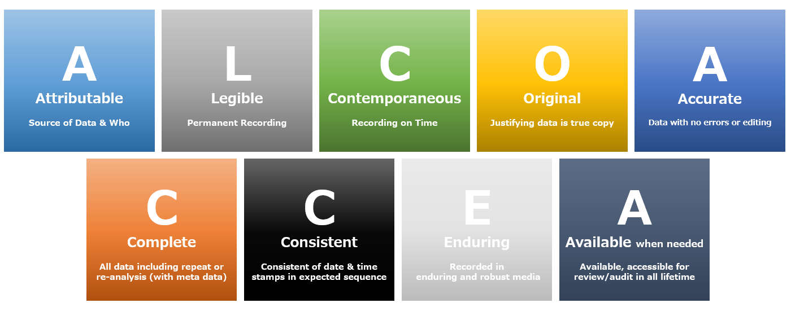

::: chapter-hero
# Chapter 2

## FAIR basics

FAIR is a quick way to describe **good structure**. It helps us design research outputs so they can be found, understood, accessed appropriately, and reused responsibly.
:::

::: chapter-overview
### What this chapter does

This chapter introduces the FAIR principles: **Findable, Accessible, Interoperable and Reusable**. It explains what each term means in practical research work, why FAIR is not the same as "open", and how FAIR applies to more than datasets.

The aim is not to turn FAIR into a compliance checklist. The aim is to use FAIR as a simple framework for thinking about the structure, documentation and future use of research outputs.
:::

## Learning objectives

By the end of this chapter, you should be able to:

-   explain what the FAIR principles are and why they matter;
-   distinguish FAIR from openness, documentation and data management planning;
-   describe what **Findable**, **Accessible**, **Interoperable** and **Reusable** mean in practice;
-   recognise how FAIR applies to data, code, protocols, documentation and workflows;
-   explain why accessibility does not necessarily mean public openness;
-   identify practical steps that make research outputs more FAIR;
-   understand how FAIR connects to data integrity principles such as ALCOA.

This chapter builds on [Chapter 1 --- Why Open Research and Reproducibility?](01-why-open.qmd). Chapter 1 introduced the problem: research can become difficult to understand, check or reuse when decisions, files, code and outputs are poorly documented. FAIR gives us a language for designing outputs so they remain useful beyond the immediate project.

## What FAIR means

FAIR stands for **Findable, Accessible, Interoperable and Reusable** [@wilkinson2016fair; @gofairPrinciples].

In simple terms, FAIR asks whether a research output has been structured and described well enough that someone else --- or your future self --- can:

-   discover that it exists;
-   understand what it is;
-   know how access is managed;
-   interpret it correctly;
-   judge whether and how it can be reused.


::: figure-box
### FAIR as "good structure"

| FAIR element      | Practical question                                 | What this means                                                             |
|------------------|----------------------|--------------------------------|
| **Findable**      | Can people discover that this output exists?       | Use persistent identifiers, clear titles, keywords and searchable metadata. |
| **Accessible**    | Is it clear how the output can be accessed?        | State access routes, restrictions, permissions and conditions.              |
| **Interoperable** | Can it work with other systems, tools or datasets? | Use appropriate formats, standards, vocabularies and consistent structure.  |
| **Reusable**      | Can it be used again responsibly?                  | Provide context, provenance, versioning, licences and limitations.          |

FAIR is a way to design outputs so they can be **found, understood and reused**.
:::

The word "output" is important. FAIR is often introduced through data, but the same logic increasingly applies to code, protocols, documentation, workflows, metadata, software, models and other research materials [@turingwayFair; @carpentriesFairBio; @cambridgeOpenResearchLicensing].

## FAIR is not the same as "open"

A common misunderstanding is that FAIR means "make everything public". It does not.

An output may be:

-   **FAIR and open**, for example an anonymised dataset deposited in a trusted repository with a DOI, metadata and a licence;
-   **FAIR but restricted**, for example sensitive health data that cannot be downloaded publicly but has clear metadata, access conditions and governance routes;
-   **not FAIR**, even if it is publicly available, for example a spreadsheet uploaded without documentation, variables, licence or version information.

::: callout-important
### Accessibility does not imply openness

The **A** in FAIR means that access conditions are clear. It does not mean that everyone must be able to download the data.

For sensitive or restricted-access data, FAIR may mean making the metadata, access process, governance restrictions and reuse conditions clear, while keeping the data themselves protected.
:::

This distinction is particularly important for health, education, administrative and linked data. In these settings, good practice is often not "share the data openly", but rather: describe the data well, preserve the analysis materials, explain the access route, and document what cannot be shared and why [@openaireSensitiveData; @cambridgeDataAccessStatement].

## FAIR applies to more than datasets

The slides emphasise an important point: FAIR applies to more than data. In most research projects, several types of output may need to be structured, described and preserved.

::: practice-grid
::: practice-card
### Data

Raw data, processed data, derived variables, analysis-ready datasets, lookup tables and spatial layers.
:::

::: practice-card
### Code and software

Scripts, functions, packages, notebooks, computational environments and dependencies.
:::

::: practice-card
### Protocols and plans

Study protocols, analysis plans, preregistrations, data management plans and decision logs.
:::

::: practice-card
### Documentation

READMEs, metadata, data dictionaries, codebooks, SOPs, variable definitions and file inventories.
:::

::: practice-card
### Workflows

Steps linking data collection, cleaning, analysis, outputs, archiving and reuse.
:::
:::

You do not have to make everything FAIR at once. Some materials will be more important than others. A good starting point is to ask: *what would someone need in order to understand, check or reuse this work later?*

## Findable

**Findable** means that research outputs can be discovered by others, including people outside the original project.

Findability is supported by:

-   a clear title and description;
-   persistent identifiers such as DOIs;
-   author identifiers such as ORCID iDs;
-   keywords and subject terms;
-   repository records or catalogue entries;
-   metadata that can be indexed by search systems;
-   file names and folder structures that make sense beyond the original analyst.

Findability is not the same as access. A restricted dataset can still be findable if there is a public metadata record explaining what the dataset contains and how access can be requested.

::: callout-note
### Practical example

A dataset stored only on a personal laptop is not findable.\
A dataset deposited in a trusted repository with a DOI, metadata, authorship, dates, access conditions and a citation format is much more findable --- even if access to the data is restricted.
:::

## Accessible

**Accessible** means that it is clear how an output can be accessed, under what conditions, and by whom.

Access may be:

-   open, where the output can be downloaded directly;
-   mediated, where users must complete a request or registration process;
-   controlled, where access depends on approvals, contracts, information governance or safe settings;
-   closed, where access is not possible, but the reason is documented.

Accessible outputs should state:

-   who can access the material;
-   where the material is held;
-   whether access is open, restricted, embargoed or unavailable;
-   what conditions apply;
-   who to contact or what process to follow;
-   whether metadata remain available if the data are withdrawn or restricted.

For sensitive data, accessibility is often about making the **access route and restrictions** transparent, not about removing safeguards.

## Interoperable

**Interoperable** means that outputs can be understood and used correctly in different contexts, systems or tools.

Interoperability is supported by:

-   open or widely used file formats;
-   machine-readable formats where appropriate;
-   consistent variable names and coding;
-   clear units, dates, spatial references and classifications;
-   standard vocabularies, ontologies or metadata schemas where relevant;
-   documentation of transformations, exclusions and derived variables;
-   avoiding unnecessary proprietary formats when possible.

In practice, interoperability reduces friction. It helps prevent situations where a file technically exists but cannot be interpreted, combined, imported, or used correctly by another person or software environment.

## Reusable

**Reusable** means that outputs can be used again for future research, whether by others or by your future self.

Reusability depends on context. A file is not reusable simply because it exists. It needs enough information for someone to judge whether it is appropriate, valid and permitted to use.

Reusable outputs usually include:

-   a README or equivalent orientation document;
-   metadata and data dictionaries;
-   information about provenance and version history;
-   information about software, code or dependencies;
-   a licence or reuse statement;
-   known limitations and constraints;
-   citation information;
-   contact or access information where appropriate.

::: callout-tip
### Reuse is responsible reuse

FAIR does not mean encouraging inappropriate reuse. It means providing enough information for someone to understand what reuse is possible, what conditions apply, and what limitations should be respected.
:::

## How to make data more FAIR

The slides summarise six practical actions. These are not the only FAIR actions, but they are a useful starting point.

::: practice-grid
::: practice-card
### 1. Document your data

Explain the data clearly so others --- and your future self --- can understand and use them. Include a README, data dictionary, codebook and any code needed to interpret or recreate derived variables.
:::

::: practice-card
### 2. Add metadata

Metadata help others find, understand and reuse the data. Use repository metadata fields and, where relevant, discipline-specific metadata standards [@dccMetadataStandards; @cambridgeMetadata].
:::

::: practice-card
### 3. Use appropriate formats

Use open, machine-readable or widely used formats where possible. Avoid formats that require proprietary software unless there is a clear reason [@cambridgeFileFormats].
:::

::: practice-card
### 4. Make access clear

Share openly where possible. If access must be restricted, explain who can access the output, under what conditions, and through what route.
:::

::: practice-card
### 5. Link and cite outputs

Use persistent identifiers, such as DOIs, where possible. Cite datasets, code and other outputs in publications and reports. Trusted repositories make this easier because they normally provide stable records, metadata and persistent identifiers [@cambridgeFindRepository].
:::

::: practice-card
### 6. Add a licence or reuse statement

Specify what others are allowed to do with the material. For code, data and documentation, licences may differ, so state the conditions clearly [@cambridgeCreativeCommons; @cambridgeSoftwareCode].
:::
:::

These actions link directly to later chapters on project organisation, documentation, code quality, publishing, persistent identifiers and preparing for reuse.

## FAIR and sensitive or restricted data

FAIR is particularly useful when data cannot be made openly available, because it helps separate **description** from **access**.

For sensitive or restricted data, you may still be able to make the following FAIR:

-   metadata describing the dataset;
-   a data dictionary or variable list;
-   information about data provenance;
-   the protocol or analysis plan;
-   synthetic or dummy example data;
-   code that can be run in the approved environment;
-   information about governance and access routes;
-   a data access statement in the publication;
-   restrictions, retention rules and destruction plans.

The key is to record the constraint explicitly. A statement such as "data are unavailable" is rarely sufficient. A better statement explains what exists, why it cannot be openly shared, what access may be possible, and who controls access.

::: activity-box
### Short exercise: "as open as possible, as closed as necessary"

Choose one research output from your own work.

Ask:

-   Could this output be shared openly?
-   If not, what exactly prevents sharing?
-   Could the metadata, code, protocol, synthetic example or access statement still be shared?
-   Where should this decision be recorded?
:::

## FAIR, data management and DMPs

FAIR principles are closely related to data management, but they are not the same thing.

::: figure-box
### How FAIR relates to data management

```{mermaid}
flowchart LR
    A[FAIR principles] --> B[Data management practice]
    B --> C[Data Management Plan]
    C --> D[Project delivery and preservation]

    A --> A1[Design outputs so they can be found, accessed, understood and reused]
    B --> B1[Organise files, document variables, manage versions, record decisions]
    C --> C1[Explain what will be done, why, by whom and with what resources]
    D --> D1[Preserve, publish, archive or restrict outputs appropriately]
```
:::

FAIR provides the design principles. Data management practice implements those principles through day-to-day organisation, documentation, versioning, storage, security and preservation. The Data Management Plan explains how these practices will be applied, justified and resourced.

## FAIR and the research lifecycle

FAIR is not only something to think about at publication. It applies across the whole project lifecycle.

::: figure-box
### FAIR across the research lifecycle

```{mermaid}
flowchart LR
    A[Plan and design] --> B[Collect or create]
    B --> C[Store and manage]
    C --> D[Analyse and collaborate]
    D --> E[Share and disseminate]
    E --> F[Publish and reuse]
    F --> A

    A -. FAIR questions .-> A1[What outputs will exist?]
    B -. FAIR questions .-> B1[How will they be structured?]
    C -. FAIR questions .-> C1[How will they be described and protected?]
    D -. FAIR questions .-> D1[How will code, versions and decisions be recorded?]
    E -. FAIR questions .-> E1[What can be shared, restricted or cited?]
    F -. FAIR questions .-> F1[How will outputs remain reusable?]
```
:::

This lifecycle framing is useful because FAIR decisions are harder to fix at the end. For example, it is much easier to produce a useful data dictionary if variable names, coding decisions and derived variables have been documented throughout the analysis.

## Data integrity: the ALCOA principles

FAIR is about making research outputs findable, accessible, interoperable and reusable. It should be complemented by data integrity principles, which focus on whether data are reliable, traceable and trustworthy.

The **ALCOA** framework describes core characteristics of reliable records:

::: practice-grid
::: practice-card
### Attributable

It should be clear who created, collected, modified or approved the data.
:::

::: practice-card
### Legible

The record should be readable, understandable and interpretable over time.
:::

::: practice-card
### Contemporaneous

Data should be recorded at the time the activity occurred, or as soon as possible afterwards.
:::

::: practice-card
### Original

The original record, or an authorised copy, should be retained.
:::

::: practice-card
### Accurate

Data should correctly reflect what was observed, measured or derived.
:::
:::

ALCOA is useful in this workshop because it makes data integrity concrete. It asks simple questions: Who did this? When was it done? Can the record be read? Is it the original? Is it correct?

## ALCOA+ and ALCOA++

Many organisations extend ALCOA to **ALCOA+** and **ALCOA++**. The exact wording varies, but the additional principles usually emphasise completeness, consistency, durability and ongoing review.

::: figure-box
### From ALCOA to ALCOA+ and ALCOA++

| ALCOA           | ALCOA+     | ALCOA++        |
|-----------------|------------|----------------|
| Attributable    | Complete   | Integrity      |
| Legible         | Consistent | Robustness     |
| Contemporaneous | Enduring   | Transparency   |
| Original        | Available  | Accountability |
| Accurate        |            | Reliability    |

These extensions are useful because reproducibility is not only about whether a file exists. It also depends on whether the record is complete, consistent, protected from inappropriate change, available for review, and accountable.
:::

For routine research practice, this does not mean adding another complicated framework. It means checking whether your project records are traceable, understandable and defensible.



## Bringing FAIR and ALCOA together

FAIR and ALCOA answer slightly different questions.

::: figure-box
### Two complementary questions

| Framework | Main question                                                            | Practical focus                                                                          |
|-----------------|-------------------------|------------------------------|
| **FAIR**  | Can the output be found, accessed appropriately, interpreted and reused? | Metadata, identifiers, access routes, formats, documentation, licences.                  |
| **ALCOA** | Can the record be trusted as reliable and traceable?                     | Attribution, timing, legibility, originality, accuracy, completeness and accountability. |

Together, they support research outputs that are both **usable** and **trustworthy**.
:::

## Activity: apply FAIR to one output

::: activity-box
### Individual reflection or small-group discussion

Choose one research output from a current or recent project. This could be a dataset, script, protocol, report, data dictionary, map, figure, model or workflow.

For that output, ask:

-   **Findable:** Could someone discover that it exists?
-   **Accessible:** Is it clear who can access it, and under what conditions?
-   **Interoperable:** Could it be opened, interpreted and used correctly in another context?
-   **Reusable:** Is there enough context, documentation and permission information for responsible reuse?

Then identify the weakest FAIR element and one practical improvement.
:::

## Activity: quick ALCOA check

::: activity-box
### Record integrity check

Choose one important file or decision record from your project.

Ask:

-   **Attributable:** Is it clear who created or changed it?
-   **Legible:** Would someone else understand it?
-   **Contemporaneous:** Was the information recorded at the time, or reconstructed later?
-   **Original:** Is it clear which version is the original or authoritative record?
-   **Accurate:** Has it been checked against the source or decision it represents?

Use this as a quick diagnostic, not as a formal audit.
:::

## Recommended resources for this chapter

These resources are useful if you want to go beyond the workshop slides. I would treat them as a small curated reading list rather than as material everyone must read in full.

::: figure-box
### Core FAIR references

-   **Wilkinson et al. (2016)** --- the original FAIR Guiding Principles paper [@wilkinson2016fair].
-   **GO FAIR: FAIR principles** --- concise description of the FAIR principles and their sub-principles [@gofairPrinciples].
-   **The Turing Way: FAIR principles** --- accessible explanation of FAIR in relation to reproducible research and research data management [@turingwayFair].
-   **FAIR in biological practice** --- practical teaching material for applying FAIR ideas in research workflows [@carpentriesFairBio].

### Practical implementation resources

-   **Research Data Management guidance**\
    <https://library-guides.ucl.ac.uk/research-data-management/best-practices-fair-data>
-   **Cambridge Research Data Management: FAIR principles** --- useful plain-language explanation of FAIR [@cambridgeFairPrinciples].
-   **DCC disciplinary metadata standards** and **Cambridge metadata guidance** --- useful when deciding what metadata standards or fields to use [@dccMetadataStandards; @cambridgeMetadata].
-   **Cambridge file formats guidance** --- useful for explaining why open, machine-readable and widely used formats matter [@cambridgeFileFormats].
-   **Cambridge repository guidance** --- useful when deciding where to deposit data or other outputs [@cambridgeFindRepository].

### Sensitive data, access statements and licensing

-   **OpenAIRE sensitive data guide** --- useful for explaining why sensitive data can still be preserved and described safely [@openaireSensitiveData].
-   **Cambridge data access statement guidance** --- useful for writing publication statements when data are open, restricted or unavailable [@cambridgeDataAccessStatement].
-   **Cambridge Creative Commons and software/code licensing guidance** --- useful for explaining why data, documentation and code may need different licences [@cambridgeCreativeCommons; @cambridgeSoftwareCode].
-   **Horizon 2020 FAIR data management guidance** --- useful historical/policy framing for FAIR data management and DMP expectations [@h2020FairDmp].
:::

## What comes next?

FAIR and ALCOA provide the principles. The next chapters move into implementation.

Later chapters cover:

-   project organisation and continuity;
-   data management planning;
-   file naming, folder structures and tidy data;
-   documentation, README files, metadata, ELNs and SOPs;
-   code quality, testing and automation;
-   publishing, persistent identifiers and preparing for reuse.

You are not expected to solve everything in this chapter. The aim is to recognise the principles and start applying them proportionately.

::: chapter-summary
## Key takeaways

-   FAIR is a way to describe good structure for research outputs.
-   FAIR does not mean "make everything public".
-   Accessibility means clear access conditions, not necessarily open access.
-   FAIR applies to data, code, protocols, documentation and workflows.
-   FAIR actions include documentation, metadata, appropriate formats, access statements, persistent identifiers and licences.
-   ALCOA complements FAIR by focusing on data integrity, traceability and trustworthiness.
-   The aim is proportionate, defensible practice --- not perfection.
:::
