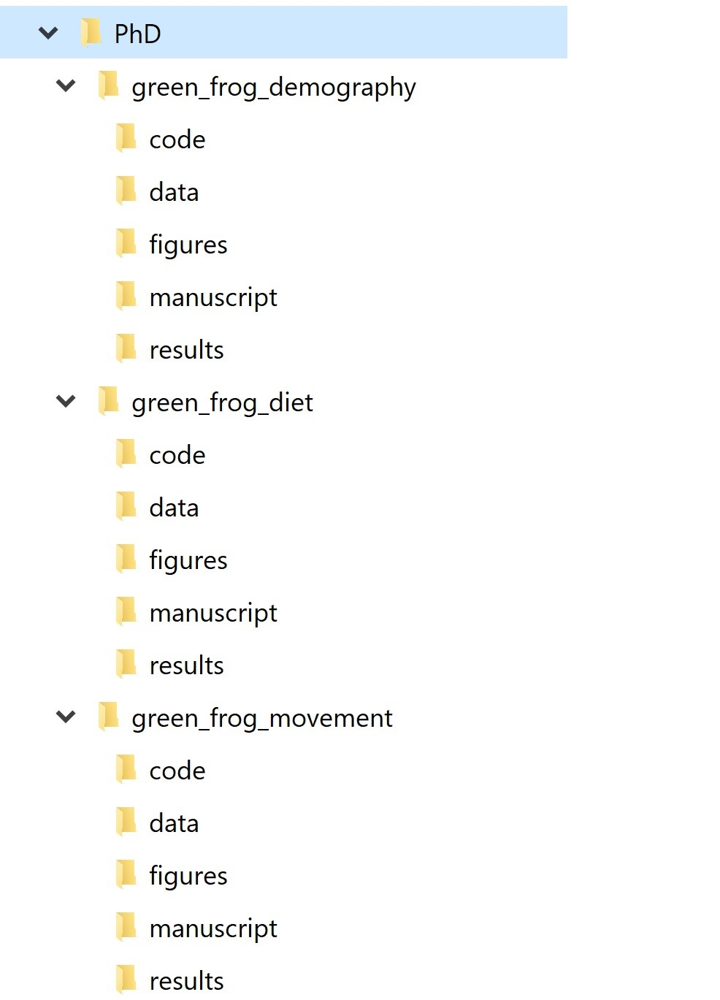
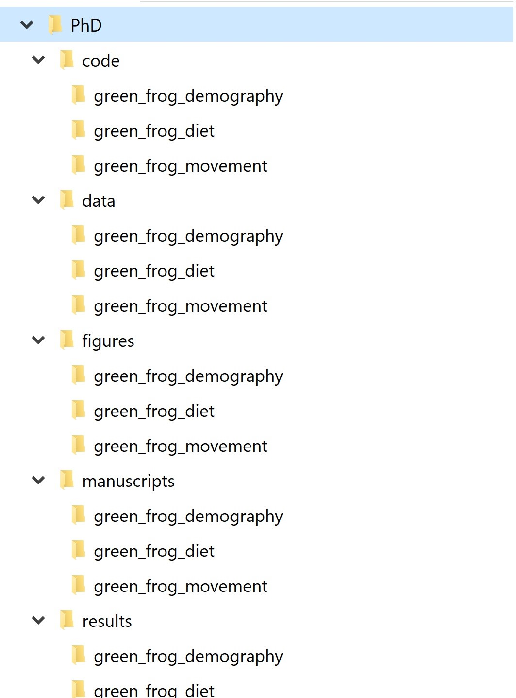
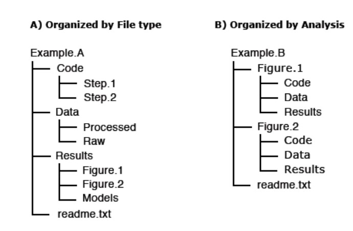
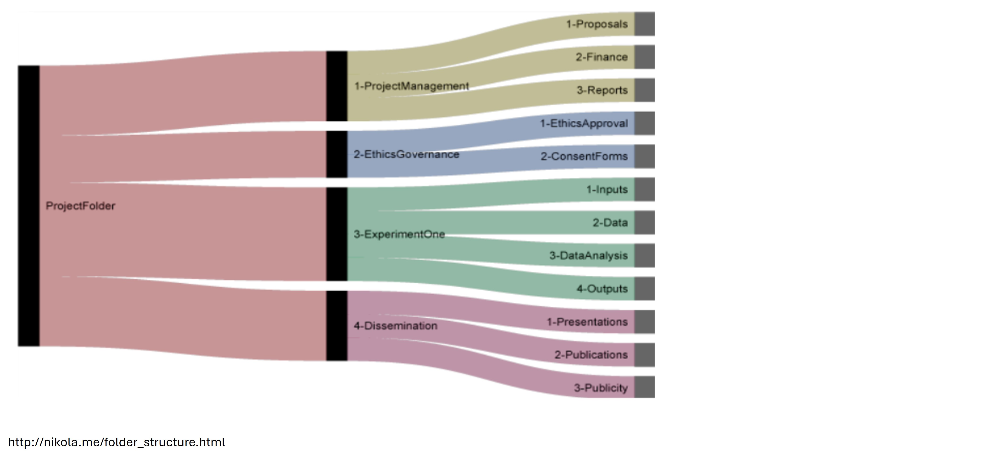
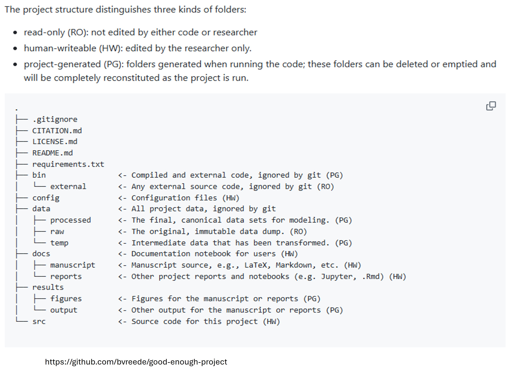

::: chapter-hero
# Chapter 3

## Project organisation and continuity

Reproducibility often lives in ordinary project habits: where files are kept, how they are named, how versions are handled, and whether someone joining the project later can understand what is going on.
:::

::: chapter-overview
### What this chapter does

This chapter focuses on the practical structure of a research project. It is about making a project legible: to collaborators, to reviewers, to supervisors, to future team members, and to your future self.

The emphasis is on everyday organisation rather than formal governance. Data Management Plans are covered in the next chapter. Here, we focus on how good planning becomes visible in folders, file names, raw-data protection, lightweight versioning and project-level orientation.
:::

## Learning objectives

By the end of this chapter, you should be able to:

-   explain why project organisation is central to reproducibility and continuity;
-   distinguish between a project folder and a well-organised project;
-   choose a folder structure that reflects the work being done;
-   separate raw, derived and output files in a way that protects provenance;
-   apply file naming conventions that make meaning and version history visible;
-   use simple versioning practices without turning the workshop into a Git course;
-   identify what belongs in the project README and what belongs in a later DMP, data dictionary or decision log.

This chapter builds on [Chapter 2: FAIR basics](02-fair-basics.qmd). The next chapter, [Chapter 4: Data Management Plans](04-dmp.qmd), explains how data-management decisions, responsibilities and constraints are formally recorded.

## Why project organisation matters

Many reproducibility problems are structural rather than technical. They arise because files are scattered across drives, raw and cleaned data are mixed, outputs are overwritten, or important decisions are hidden in email, Teams messages or personal notebooks.

These problems usually feel small at the time. They become serious later: during analysis, handover, peer review, audit, publication, archiving or reuse. The CESSDA Data Management Expert Guide emphasises file organisation and documentation as practical foundations for data management and reuse [@cessdaDmeg; @cessdaFileNaming]. Similar principles are used in reproducible computational project guidance, including Noble's project organisation recommendations and the TIER protocol [@noble2009quick; @tierProtocol].

Good project organisation helps others understand:

-   what the project is for;
-   what data, code, documents and outputs exist;
-   which files are raw, derived, interim or final;
-   where the current version is;
-   what can be re-run and what is only an output;
-   where conventions and decisions are documented;
-   which materials are safe to edit and which should be preserved.

The point is not administrative tidiness for its own sake. Organisation reduces ambiguity. Ambiguity is where duplicated work, avoidable error and loss of project memory often begin.

::: callout-note
### A simple test

If someone joined your project tomorrow, could they understand the purpose of the project, the main folders, the current version of key files, and where to start within ten minutes?

If not, the project may need a clearer structure, a README, or a simpler naming and versioning convention.
:::

## A project is more than a folder

A folder is only a storage location. A project is a set of linked materials, decisions, people, constraints and outputs. A reproducible project needs more than somewhere to put files.

At minimum, a project needs five things.

::: practice-grid
::: practice-card
### Clear purpose

A short statement of what the project is trying to do, what is in scope, and what is out of scope.
:::

::: practice-card
### Defined outputs

An agreed view of what the project will produce: manuscript, report, dataset, code, figures, policy brief, teaching material, archived record or internal analysis.
:::

::: practice-card
### Shared conventions

Agreed rules for folder structure, file names, versioning and where key information is recorded.
:::

::: practice-card
### Protected provenance

A structure that preserves original data and makes it clear how derived files and outputs were created.
:::

::: practice-card
### Orientation for others

A README or equivalent starting point that explains how the project is organised and what someone should read or run first.
:::
:::

Formal responsibilities and governance are important, but they are covered in [Chapter 4: Data Management Plans](04-dmp.qmd). This chapter focuses on the day-to-day implementation: the things people see when they open the project.

## Start with the project boundary

Before designing a folder structure, clarify the boundary of the project. This is especially important when projects share datasets, code, collaborators or outputs.

Ask:

-   What is the main research question or purpose?
-   What are the expected outputs?
-   What data sources are in scope?
-   Which files are inputs, intermediate products and final outputs?
-   Which parts of the workflow are exploratory and which are intended to be repeatable?
-   Which files need to be preserved, and which can be regenerated?
-   What should someone *not* edit?

A project boundary does not need to be perfect. It needs to be explicit enough that people know where the work starts, where it ends, and what belongs elsewhere.

::: figure-box
### Project organisation as a reproducibility layer

```{mermaid}
flowchart LR
    A[Project purpose] --> B[Folder structure]
    B --> C[File naming]
    C --> D[Versioning]
    D --> E[README]
    E --> F[Handover and reuse]

    B --> G[Raw data protected]
    B --> H[Derived data traceable]
    B --> I[Outputs reproducible]
```

A good project structure does not make the research correct on its own. It makes the work easier to inspect, maintain and rerun.
:::

## Folder structure: choose a pattern and document it

There is no single correct folder structure. The best structure depends on the type of project, the outputs, the team, the data sensitivity, and whether the project is mainly exploratory, analytical, teaching-focused or publication-focused.

The important thing is to choose a pattern and document it. Data Carpentry's guidance on file naming and project organisation highlights that consistency matters more than inventing a perfect system [@dataCarpentryFileNaming]. Examples from the Good Enough Project and other reproducible science resources show that simple, stable structures are often sufficient [@goodEnoughProject; @nikolaFolderStructure].

### Common ways to organise a project

Two common approaches are to organise by **file type** or by **workflow stage**.

| Pattern           | Example folders                                          | Works well when                                         | Main risk                                                            |
|------------------|------------------|------------------|------------------|
| By file type      | `data/`, `scripts/`, `figures/`, `docs/`                 | Small to medium projects with clear scripts and outputs | Outputs may become disconnected from the analysis that produced them |
| By workflow stage | `01_import/`, `02_clean/`, `03_analysis/`, `04_outputs/` | Projects with sequential analytical steps               | Can become rigid if the project changes                              |
| By output         | `paper1/`, `policy_brief/`, `teaching_materials/`        | Projects with multiple outputs from shared inputs       | Shared data/code may be duplicated or edited inconsistently          |
| Hybrid            | stable top-level folders plus numbered scripts           | Most research projects                                  | Needs a README so the logic is visible                               |

A hybrid structure usually works best for research projects: stable top-level folders, numbered scripts for sequence, and clear separation between raw data, derived data and outputs.

### A baseline folder structure

For many research projects, a simple structure is enough.

``` text
project-name/
├── README.md
├── data/
│   ├── raw/
│   ├── processed/
│   └── metadata/
├── scripts/
│   ├── 01_import.R
│   ├── 02_clean.R
│   ├── 03_analysis.R
│   └── 04_outputs.R
├── outputs/
│   ├── tables/
│   ├── figures/
│   └── reports/
├── docs/
│   ├── decision-log.md
│   ├── changelog.md
│   └── notes/
└── references/
```

This is only a starting point. Adapt it to the project. For example, a qualitative project might need `transcripts/`, `coding_framework/` and `analysis_memos/`. A spatial project might need `gis/`, `shapefiles/`, `rasters/` or `exposure_surfaces/`. A systematic review might need `searches/`, `screening/`, `extraction/` and `quality_appraisal/`.

{fig-align="left" width="300"}

{width="300"}







::: callout-tip
### Keep it boring

A good folder structure should be unsurprising. People should not need specialist knowledge of your memory or habits to find the data, scripts, outputs or documentation.
:::

## Raw, derived and output files

The most important organisational distinction is between **raw data**, **derived data** and **outputs**.

::: definition-grid
::: definition-card
### Raw data

The original data as received, downloaded, extracted or collected. These files should be preserved and not edited manually.
:::

::: definition-card
### Derived data

Files created from raw data through cleaning, linkage, recoding, filtering, aggregation or analysis.
:::

::: definition-card
### Outputs

Tables, figures, models, reports, manuscripts or other materials produced from the data and code.
:::
:::

### Never overwrite raw data

Raw data should be treated as read-only. If changes are needed, make the changes in code and write the result to a derived or processed folder. This gives you a route back if something goes wrong.

A practical pattern is:

``` text
data/raw/          original input files, never edited
data/processed/    cleaned or linked files created by scripts
outputs/           tables, figures, reports and model outputs
scripts/           code that generates processed data and outputs
```

For sensitive data, the actual storage location may be a secure drive or trusted research environment rather than the project folder. The same logic still applies: raw inputs should be protected, transformations should be traceable, and derived outputs should be clearly labelled.

::: callout-warning
### Common risk point

If the only copy of the cleaned data has been manually edited in Excel, and no one can reconstruct what changed, the analysis is fragile.
:::

## Project-level README

A README is the front door of a project. It should help a new person understand what the project is, where things are, and what to do first.

A project README does not need to be long. It should answer five basic questions.

| Question                        | What to include                                                           |
|------------------------------------|------------------------------------|
| What is this project?           | Purpose, scope, key outputs, status                                       |
| What does it contain?           | Main folders and file types                                               |
| What are the main data sources? | Data origin, restrictions, raw/processed distinction                      |
| How does the workflow run?      | Main scripts, order, software requirements                                |
| What are the rules?             | Naming conventions, versioning, licence/access conditions, contact person |

A README is not a substitute for a DMP, data dictionary, SOP or decision log. It is the orientation document that points to them.

### A minimal README template

``` markdown
# Project title

## Purpose
One paragraph describing the aim, scope and main outputs.

## Project status
Active / paused / archived / teaching example / publication support.

## Folder structure
Brief description of each top-level folder.

## Data sources
List main data sources and where access restrictions are documented.

## How to reproduce key outputs
Explain which scripts to run, in what order, and any software requirements.

## Naming and versioning conventions
State the file naming pattern used in this project.

## Documentation
Link to the decision log, changelog, data dictionary, DMP and any SOPs.

## Contact
Name or role responsible for maintaining the project record.
```

## File naming: make meaning visible

File names are a form of documentation. Good file names help people identify the content, status and date of a file without opening it. Poor file names create ambiguity, especially during collaboration and handover.

CESSDA and Data Carpentry both recommend descriptive, consistent and machine-friendly names [@cessdaFileNaming; @dataCarpentryFileNaming].

### Good file names usually

-   are descriptive enough to be understood without opening the file;
-   use consistent elements in a consistent order;
-   avoid spaces and special characters;
-   use ISO-style dates (`YYYY-MM-DD`) where dates are needed;
-   use leading zeros for numbered files (`01`, `02`, `03`);
-   include a version number where versions need to be visible;
-   avoid jokes, personal shorthand or names tied to one person.

### A simple naming pattern

A useful pattern is:

``` text
project_component_description_YYYY-MM-DD_v01.ext
```

Examples:

``` text
eyp_cleaned_addresses_2025-03-15_v02.csv
analysis_modelA_results_2025-03-20_v01.rds
manuscript_methods_draft_2025-03-22_v03.docx
decision-log_project_2025-03-22_v01.md
```

Avoid:

``` text
data_new.xlsx
analysis_final_v2_REAL_final2.xlsx
table1_revised_use_this_one.xlsx
jo_notes_latest.docx
```

::: callout-important
### "Final" is not a versioning system

Words like `final`, `real_final`, `latest` and `use_this_one` usually mean the project has lost a clear versioning convention.
:::

### Which would you prefer?

``` text
analysis_final_v2_REAL_final2.xlsx
```

or

``` text
analysis_modelA_results_2025-03-20_v03.xlsx
```

The second file name is not perfect, but it tells you what the file is, when it was created, and which version it is.

## Versioning without making this a Git workshop

Version control means keeping track of changes so that earlier states can be recovered and current work can be understood. For code, Git is the most powerful and widely used tool. However, not every participant needs a full Git workflow before they can improve reproducibility.

For this workshop, start with proportionate versioning:

-   do not overwrite raw data;
-   use stable file names for scripts and outputs;
-   use dates and version numbers consistently where needed;
-   keep a changelog for meaningful updates;
-   use numbered scripts to make workflow order visible;
-   keep old versions only where they are meaningful;
-   avoid parallel personal versions such as `analysis_Jo.R`, `analysis_Matt_edits.R`, `analysis_new.R`.

### When a filename version is enough

Filename versioning may be sufficient for:

-   draft reports;
-   circulated manuscripts;
-   frozen data extracts;
-   external files received from collaborators;
-   teaching materials or workshop drafts.

### When you need a changelog

A changelog is useful when changes affect interpretation, reproducibility or reuse. Examples include:

-   updating the data extract;
-   changing inclusion/exclusion criteria;
-   changing an exposure definition;
-   changing an analysis model;
-   correcting an error;
-   changing a file format;
-   preparing a release for archiving.

A simple changelog can be a table:

| Date       | File or component | Change                         | Reason                                   | Who |
|---------------|---------------|---------------|---------------|---------------|
| 2026-03-10 | `02_clean.R`      | Added postcode validation step | Missing postcodes were not being flagged | JC  |
| 2026-03-14 | `data/processed/` | Recreated cleaned dataset      | Updated raw extract received             | JC  |
| 2026-03-18 | `outputs/tables/` | Regenerated Table 1            | Categories corrected after review        | JC  |

### When Git becomes useful

Git becomes particularly useful when:

-   multiple people edit code;
-   the project includes many scripts;
-   you need to compare changes over time;
-   you want to publish code with a DOI later;
-   you want a robust record of analytical development.

Git and GitHub are introduced later in relation to code quality and release. Here, the key principle is simpler: changes should be visible and recoverable.

::: callout-note
### Versioning principle

You should be able to answer: what changed, when, why, and where is the previous version if we need it?
:::

## Decisions should not live only in email

Email and chat messages are useful for discussion but poor places to store the project record. Decisions become hard to find, people are left out of threads, and the reasoning behind analytical choices may be lost.

A project should have a visible place for decisions that affect interpretation or reproducibility. This may be a decision log, analysis log, lab notebook, issue tracker, or structured document.

Examples of decisions worth recording include:

-   changing inclusion or exclusion rules;
-   choosing between alternative exposure metrics;
-   changing a variable definition;
-   excluding records because of data quality concerns;
-   using a restricted dataset under specific governance conditions;
-   deciding what can be shared and what must remain restricted;
-   changing software or package versions where it affects results.

Decision logs are covered in more detail in the documentation chapter. In this chapter, the important point is that the project structure should include somewhere for decisions to go.

## A DMP is the agreement; the project structure is the implementation

The Data Management Plan records the project's formal decisions about data sources, storage, access, documentation, retention, sharing and responsibilities. The project structure is where these decisions become everyday practice.

| DMP decision                       | Project implementation                                           |
|------------------------------------|------------------------------------|
| Raw data must not be altered       | `data/raw/` protected and treated as read-only                   |
| Derived files must be reproducible | cleaning scripts write to `data/processed/`                      |
| Access is restricted               | restricted files stored in approved secure location              |
| Outputs must be archived           | final outputs placed in a release or archive folder              |
| Data must be documented            | data dictionary and README stored in `docs/` or `data/metadata/` |
| Changes must be traceable          | changelog and versioned outputs maintained                       |

This avoids repetition between chapters. Chapter 3 shows what good organisation looks like in practice. Chapter 4 explains how the relevant data-management decisions and responsibilities are recorded.

## Proportionate project organisation

A small MSc project, a multi-site clinical study, an administrative data linkage project and a national policy evaluation do not need identical structures. The level of organisation should be proportionate to risk, scale and likely reuse.

However, almost every project benefits from a minimum viable structure.

::: practice-grid
::: practice-card
### One project root

Keep the project materials in one clear location, or document where restricted materials are stored.
:::

::: practice-card
### One README

Provide a clear starting point for anyone opening the project.
:::

::: practice-card
### Protected raw data

Preserve original inputs and avoid manual edits.
:::

::: practice-card
### Clear naming

Use consistent, descriptive and machine-friendly file names.
:::

::: practice-card
### Visible versions

Record meaningful changes and avoid ambiguous "final" files.
:::

::: practice-card
### Documentation links

Make it obvious where the DMP, data dictionary, decision log and code are stored.
:::
:::

## Activity: project organisation diagnostic

::: activity-box
### Individual reflection or small-group discussion

Choose one current or recent project.

Assess it using the questions below:

-   Is there one obvious project root or starting point?
-   Is there a README or equivalent orientation document?
-   Are raw, processed and output files clearly separated?
-   Could someone identify the latest version of the main outputs?
-   Are file names descriptive and consistent?
-   Is there somewhere to record decisions and changes?
-   Are restricted or sensitive materials clearly labelled and protected?

Identify one small change that would make the project easier to understand or hand over.
:::

## Activity: beginner and advanced next steps

::: activity-box
### Choose one action

**Beginner option:**\
Create or update a project README. Add the purpose, folder structure, data sources and where to find key outputs.

**Intermediate option:**\
Rename one small set of files using a consistent pattern. Do not rename everything at once unless you can update scripts and links safely.

**Advanced option:**\
Create a changelog and record the last three meaningful changes to the project. Include what changed, when, why and who made the decision.
:::

## Recommended resources for this chapter

::: resource-box
### Project organisation and file naming

-   CESSDA Data Management Expert Guide: file naming and folder structure [@cessdaFileNaming]
-   Data Carpentry: file naming and project organisation [@dataCarpentryFileNaming]
-   Noble: *A Quick Guide to Organizing Computational Biology Projects* [@noble2009quick]
-   The TIER Protocol for reproducible empirical research [@tierProtocol]
-   Good Enough Project template [@goodEnoughProject]
-   Example folder structures for research projects [@nikolaFolderStructure]
:::

## What comes next?

This chapter focused on the visible structure of a project: folders, file names, raw-data protection, versioning and the README.

The next chapter explains how these practices connect to the formal Data Management Plan: the document that records data-related decisions, constraints, responsibilities, access conditions and plans for archiving or sharing.

::: chapter-summary
## Key takeaways

-   Project organisation is a reproducibility practice, not just an administrative preference.
-   A project needs a clear purpose, defined outputs, shared conventions, protected provenance and a starting point.
-   Raw data should be preserved and never overwritten manually.
-   File names should make meaning, date and version status visible.
-   Versioning can start simply: dates, version numbers, changelogs and recoverable changes.
-   The DMP records decisions; the project structure implements them.
:::
