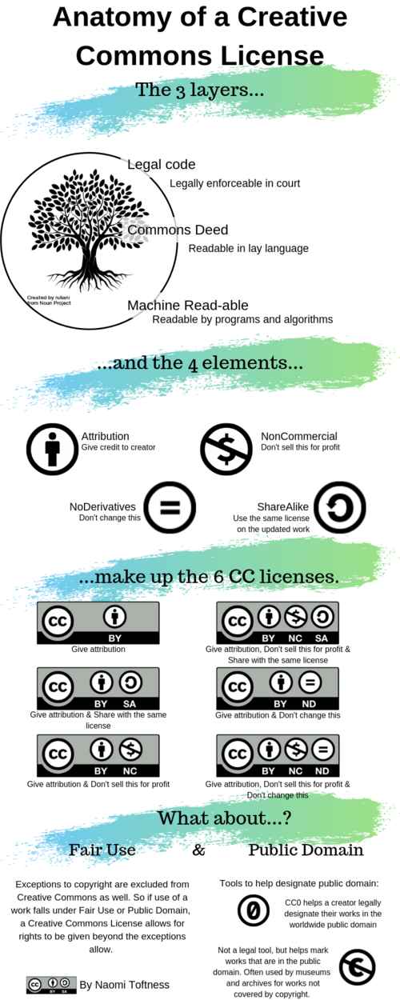

::: chapter-hero
# Chapter 8

## Publishing, persistent identifiers and preparing for reuse

Publishing is not only about the journal article. It is the point at which research outputs are released, described, cited, licensed and made available for appropriate reuse.
:::

::: chapter-overview
### What this chapter does

This chapter brings together repositories, persistent identifiers, preprints, access statements, licensing, software and data citation, and preparing research objects for reuse.

The focus is responsible release. Not everything can or should be fully open, especially when research involves sensitive data, legal restrictions or third-party agreements. However, even restricted outputs can usually be described, preserved and made more findable through metadata, access statements and clear governance.
:::

## Learning objectives

By the end of this chapter, you should be able to:

-   understand publishing as the release of research outputs, not only papers;
-   identify which outputs from a project could be shared, archived or described;
-   explain how persistent identifiers support credit, linkage and traceability;
-   distinguish access decisions from licensing decisions;
-   prepare data, code, documentation and other outputs for responsible reuse;
-   recognise how publishing choices affect reproducibility, sustainability and long-term value.

This chapter builds on [Chapter 2 --- FAIR basics](02-fair-basics.qmd), [Chapter 4 --- Data Management Plans](04-dmp.qmd), [Chapter 6 --- Documentation and protocols](06-docs-eln-sops.qmd), and [Chapter 7 --- Coding for reproducible research](07-code-quality-testing.qmd).

------------------------------------------------------------------------

## What belongs in this chapter?

Earlier chapters covered how to organise, document and check the work while the project is active. This chapter focuses on what happens when outputs are ready to be shared, archived, cited or made discoverable.

::: practice-grid
::: practice-card
### Repositories

Where outputs are deposited, preserved and made discoverable.
:::

::: practice-card
### Persistent identifiers

How outputs, people and organisations are linked and credited over time.
:::

::: practice-card
### Access and licensing

Who can access an output, and what they are allowed to do with it.
:::

::: practice-card
### Reuse package

The documentation, metadata and context that make reuse possible.
:::
:::

Data management plans record decisions; project organisation keeps materials findable; documentation explains methods and decisions; coding makes outputs rerunnable. Publishing brings these together into a stable, citable release.

------------------------------------------------------------------------

## Publishing beyond the paper

Research outputs extend beyond journal articles. They may include:

-   datasets and metadata;
-   analysis code and workflows;
-   protocols, preregistrations and documentation;
-   computational notebooks and reports;
-   figures, tables and derived materials;
-   preprints and accepted manuscripts;
-   software, packages or apps;
-   training materials and reusable templates.

Publishing these outputs supports transparency, enables reuse, and ensures appropriate attribution. However, different outputs require different access routes, licences, documentation and preservation strategies.

::: callout-note
### Key point

Publishing does not mean uploading everything to a website. It means making deliberate decisions about what is released, where it is preserved, how it is described, who can access it, and how it should be cited.
:::

------------------------------------------------------------------------

## Publishing as release management

It is useful to think of publishing as creating a **release** of a research object.

A release usually involves:

-   deciding what is in scope;
-   freezing a version;
-   documenting what the release contains;
-   describing known limitations;
-   assigning or recording a persistent identifier;
-   specifying access conditions;
-   applying an appropriate licence;
-   linking related outputs, such as data, code and publications.

Thinking in terms of releases is particularly helpful when outputs evolve over time. For example, code may continue to change after a paper is submitted, or a dataset may be updated after new linkage or cleaning. A release marks the version that supports a specific output, paper or decision.

::: callout-tip
### Practical habit

Before submission, create a checklist of the exact data, code, documentation and outputs that support the paper. This helps avoid the common problem where the published article is linked to a moving or unclear version of the underlying materials.
:::

------------------------------------------------------------------------

## Sharing is not the same as enabling reuse

Sharing means making something available.

Enabling reuse requires more than access. It requires enough context for someone else to understand what the output is, how it was produced, what restrictions apply, and how it can be used appropriately.

A reusable output usually needs:

-   a clear title and description;
-   authorship and contributor information;
-   date and version;
-   relationship to other outputs;
-   metadata;
-   methods or provenance information;
-   file format information;
-   access conditions;
-   licence;
-   citation instructions;
-   contact or support route where appropriate.

You can upload a dataset and still make it unusable. Without context, documentation and licensing, others may not be able to interpret it, cite it or reuse it responsibly.

------------------------------------------------------------------------

## Repositories: where to deposit outputs

Repositories support preservation, discovery, citation and reuse. They are usually better than personal websites, shared drives or ad hoc file sharing because they provide stable records, metadata and persistent identifiers.

Common repository options include:

-   **institutional repositories**, such as the UCL Research Data Repository;
-   **general repositories**, such as Zenodo, Figshare or the Open Science Framework;
-   **discipline-specific repositories**, where these exist;
-   **software platforms linked to releases**, such as GitHub archived through Zenodo;
-   **controlled-access repositories**, where data are sensitive or restricted.

Repository choice should be guided by the output type, disciplinary expectations, funder or journal requirements, data sensitivity, file size, access controls and whether the repository issues persistent identifiers.

::: callout-important
### Sensitive or restricted data

Publishing sensitive data does not usually mean making the data openly downloadable. It may mean publishing metadata, documentation and access conditions, while the data themselves remain controlled, safeguarded or mediated.
:::

### Choosing a repository

Useful questions include:

-   Does the repository accept this type of output?
-   Does it issue a DOI or other persistent identifier?
-   Does it support versioning?
-   Does it allow appropriate access controls?
-   Does it support clear licensing?
-   Is it recognised by your funder, journal or discipline?
-   Will the output be preserved beyond the lifetime of the project?
-   Can related outputs be linked together?

Repository registries and guidance such as re3data, FAIRsharing, institutional library guidance and The Turing Way can help identify appropriate options.

------------------------------------------------------------------------

## Persistent identifiers

Persistent identifiers provide stable references to research outputs, people and organisations. They help link outputs across systems and reduce reliance on unstable URLs.

Common examples include:

::: definition-grid
::: definition-card
### DOI

A Digital Object Identifier is a persistent identifier for research outputs such as articles, datasets, code releases, preprints, protocols and reports.
:::

::: definition-card
### ORCID iD

An ORCID iD is a persistent identifier for a researcher. It helps link outputs to a person despite name changes, name variants or institutional moves.
:::

::: definition-card
### ROR ID

A Research Organization Registry identifier is a persistent identifier for a research organisation. UCL, for example, has a ROR ID.
:::
:::

Persistent identifiers support:

-   discovery;
-   citation;
-   credit;
-   attribution;
-   version tracking;
-   linking datasets, code, papers and protocols;
-   reporting for institutions, funders and research assessment.

### DOI is not just a link

A DOI is more than a convenient URL. It is a stable identifier supported by metadata. The DOI should resolve to a landing page that describes the object, provides access information and gives citation details.

For datasets and code, the landing page is often as important as the file itself because it records title, creators, version, licence, funder, related outputs and access conditions.

------------------------------------------------------------------------

## Data and code availability statements

Many journals now require data and code availability statements. These statements should explain what is available, where it can be found, and what restrictions apply.

A weak statement says only:

> Data are available on request.

A stronger statement explains:

-   what data exist;
-   whether they can be shared;
-   where metadata are available;
-   whether code is available;
-   what repository or DOI applies;
-   what restrictions apply and why;
-   who can request access;
-   what approval or data-sharing agreement is required.

Examples:

``` text
The analysis code supporting this study is available at [repository/DOI]. The individual-level linked administrative data cannot be made openly available because they are subject to data-provider agreements and information governance restrictions. Metadata and variable descriptions are available at [repository/DOI]. Access requests should be directed to [data provider/institutional route].
```

``` text
The dataset and code supporting this analysis are available in the UCL Research Data Repository at [DOI] under a CC BY 4.0 licence. The repository record includes the README, data dictionary and analysis scripts required to reproduce the tables and figures.
```

Availability statements are part of the reuse package. They should be written early enough that restrictions are understood before submission.

------------------------------------------------------------------------

## Preprints as early dissemination

Preprints are public versions of research outputs shared before formal peer review. They support early dissemination, transparency and feedback, and are now widely used in many areas of health, population and computational research.

Preprints can:

-   make findings visible earlier;
-   establish precedence and credit;
-   invite methodological and substantive feedback;
-   allow sharing when journal publication is delayed.

However, preprints:

-   have not undergone peer review;
-   may change substantially before publication;
-   should be interpreted with caution, especially for policy- or clinically relevant findings;
-   may be subject to journal, funder or institutional expectations.

Good practice includes clearly labelling outputs as preprints, linking to subsequent accepted or published versions where available, and avoiding overstatement of findings.

Preprints are part of the publishing lifecycle, not a replacement for peer review.

------------------------------------------------------------------------

## Reporting guidelines and transparency

Reporting guidelines help ensure that publications include the minimum information needed for interpretation, appraisal and reuse. They do not replace good study design or reproducible workflows, but they improve the completeness and transparency of reporting.

Examples include:

-   **CONSORT** for randomised trials;
-   **SPIRIT** for trial protocols;
-   **STROBE** for observational studies;
-   **PRISMA** for systematic reviews and meta-analyses;
-   **STARD** for diagnostic accuracy studies;
-   **MOOSE** for meta-analyses of observational studies.

The EQUATOR Network curates reporting guidelines across study designs and disciplines.

Reporting guidelines fit here because they are part of preparing outputs for publication. They should be considered alongside repository deposits, availability statements, licences and metadata.

------------------------------------------------------------------------

## Access and licensing are different decisions

Publishing for reuse usually involves two decisions:

1.  **Access route** --- who can see or obtain the output?
2.  **Reuse licence** --- what can they do with it once they have lawful access?

These decisions are related but not the same.

For example:

-   data may be openly accessible but licensed for limited reuse;
-   data may be access-controlled but licensed permissively once access is approved;
-   metadata may be open even when underlying data are restricted;
-   code may be open but depend on restricted data.

Separating access from licensing supports clearer governance and more appropriate reuse.

::: callout-warning
### Licence does not override governance

You cannot licence away confidentiality, consent limits, data-provider restrictions or contractual obligations. Access and reuse decisions must remain consistent with ethics, governance and legal constraints.
:::

------------------------------------------------------------------------

## Common licence families

Different outputs need different licences.

| Output type                                           | Typical licence family                                               | What it enables                                                         | Common pitfalls                                                               |
|------------------|------------------|------------------|------------------|
| Papers, figures, reports, READMEs, training materials | Creative Commons licences                                            | Reuse of text, figures and educational material with defined conditions | Restrictive variants can block adaptations, translations or teaching reuse    |
| Metadata records                                      | Often CC0                                                            | Maximises discoverability and machine reuse                             | Metadata must still avoid disclosing confidential or sensitive information    |
| Code and software                                     | Open-source software licences such as MIT, Apache 2.0 or GPL         | Reuse, modification and redistribution of code                          | Licence mismatch across dependencies; unclear ownership in collaborative code |
| Data                                                  | Context-dependent; may be CC0, CC BY or more restricted where lawful | Reuse where sharing is lawful and ethical                               | Governance, consent and contractual restrictions override licence preferences |



::: callout-tip
### A proportionate default

For many research projects:

-   use **CC BY** for text, training materials and documentation unless there is a clear reason to restrict adaptations;
-   choose an explicit software licence for code, such as **MIT** or **Apache 2.0**, where appropriate;
-   consider **CC0** for metadata where lawful and safe;
-   for sensitive data, publish metadata and access conditions even when data cannot be open.
:::

------------------------------------------------------------------------

## Software and code citation

Code is a research output. It should be cited when it supports a publication or is reused by others.

Good practice includes:

-   creating a release of the code used for the paper;
-   depositing or archiving the release in a repository that issues a DOI;
-   including a citation file, such as `CITATION.cff`, where appropriate;
-   documenting dependencies and software versions;
-   linking the code release to the paper and related datasets.

GitHub alone is useful for collaboration, but it is not the same as a preserved release. For citation and archiving, GitHub releases can be connected to repositories such as Zenodo to mint DOIs for specific versions.

### Computational notebooks

Jupyter, R Markdown and Quarto notebooks can be useful research objects. To make them reusable, consider:

-   whether the notebook runs from top to bottom;
-   whether outputs are embedded or regenerated;
-   whether data dependencies are clear;
-   whether the computational environment is recorded;
-   whether the notebook is deposited with sufficient metadata;
-   whether outputs are versioned and citable.

A notebook that only works on the author's computer is not yet a reusable research object.

------------------------------------------------------------------------

## Discontinuing or maintaining software

Not all research software will be maintained indefinitely. This is normal, but it should be communicated clearly.

If software or code will no longer be maintained, consider:

-   archiving the final release;
-   stating that active development has ended;
-   documenting known limitations;
-   identifying dependencies and last-tested versions;
-   linking to successor tools where available;
-   preserving the code with a DOI if it supports published findings.

This is part of responsible reuse. Users should not have to guess whether a tool is maintained, deprecated or unsafe to use.

------------------------------------------------------------------------

## Context is part of the output

Reuse depends on context.

Good publishing practice includes documenting:

-   analytical assumptions and decisions;
-   known limitations and sources of uncertainty;
-   constraints on interpretation or reuse;
-   relationships between outputs;
-   provenance;
-   file formats and software dependencies;
-   access routes and restrictions.

This includes structured metadata that supports discovery and interpretation, even when access to the underlying data is restricted.

::: callout-note
### Metadata can often be open when data cannot

For sensitive or restricted data, an open metadata record can still support discovery, citation and transparency without exposing confidential data.
:::

------------------------------------------------------------------------

## Preparing a reuse package

A practical reuse package might include:

::: practice-grid
::: practice-card
### README

What the output is, what files are included, how they relate, and how to use them.
:::

::: practice-card
### Metadata

Structured description for discovery, interpretation and citation.
:::

::: practice-card
### Licence

What reuse is permitted, for each output type.
:::

::: practice-card
### Access statement

What is available, what is restricted, why, and how access can be requested.
:::

::: practice-card
### Version information

Release date, version number, changelog and relationship to the paper.
:::

::: practice-card
### Citation information

How the output should be cited, including DOI and ORCID where relevant.
:::
:::

The level of detail should be proportionate to the output and its likely reuse. A complex linked administrative dataset requires more governance and metadata than a training handout, but both benefit from clear citation, licence and version information.

------------------------------------------------------------------------

## Sustainability and publishing

Well-prepared outputs reduce downstream burden.

Clear documentation, stable releases and archived outputs:

-   reduce repeated clarification requests;
-   avoid unnecessary recomputation;
-   support long-term reuse without ongoing effort;
-   reduce the risk of abandoned or unusable outputs;
-   make outputs easier to cite and credit.

Publishing is therefore part of sustainable research practice. Choices about what to publish, how to document it and where to archive it directly affect reproducibility and long-term value.

------------------------------------------------------------------------

## Practical guidance for researchers

For most projects, a proportionate publishing workflow is:

1.  List the project outputs: paper, data, code, documentation, figures, protocols, notebooks.
2.  Decide which outputs can be open, restricted, described only, or not shared.
3.  Choose suitable repositories.
4.  Prepare README files, metadata and availability statements.
5.  Choose an appropriate licence for each output type.
6.  Create a stable version or release.
7.  Mint or record persistent identifiers.
8.  Link outputs together in the paper and repository records.
9.  Add citation guidance.
10. Keep a record of what was released and when.

You do not need to publish everything. You do need to make clear, defensible and documented decisions.

------------------------------------------------------------------------

## Exercises

### Exercise 1: Output inventory

Choose one recent or current project.

List all possible outputs:

-   paper or preprint;
-   dataset;
-   metadata;
-   code;
-   figures and tables;
-   protocol or analysis plan;
-   documentation;
-   training or engagement materials.

For each output, decide whether it could be:

-   openly shared;
-   shared under controlled access;
-   described through metadata only;
-   not shared, with a reason.

### Exercise 2: Repository and DOI check

Choose one output.

Ask:

-   Where would it be deposited?
-   Would the repository issue a DOI?
-   Would the output need versioning?
-   What metadata would be required?
-   What related outputs should it link to?

### Exercise 3: Access versus licence

Choose one output and answer two separate questions:

1.  Who can access it?
2.  What can they do with it once they have access?

If these answers are not clear, the output is not yet ready for responsible reuse.

## Recommended resources for this chapter

::: figure-box
### Persistent identifiers and citation

-   ORCID: <https://orcid.org/>
-   DataCite: <https://datacite.org/>
-   Research Organization Registry (ROR): <https://ror.org/>
-   ARDC DOI Decision Tree: <https://ardc.edu.au/resource/doi-decision-tree/>
-   The Turing Way --- Citable research objects: <https://book.the-turing-way.org/communication/citable/>
-   The Turing Way --- Data and software citation: <https://book.the-turing-way.org/communication/citable/citable-steps/>
-   ARDC --- Citing software: <https://ardc.edu.au/resource/citing-software/>

### Repositories and archiving

-   UCL Research Data Repository: <https://www.ucl.ac.uk/library/open-science-research-support/research-data-management/ucl-research-data-repository>
-   The Turing Way --- Choosing a repository: <https://book.the-turing-way.org/reproducible-research/rdm/rdm-repository/>
-   CESSDA --- Archive and publish: <https://dmeg.cessda.eu/Data-Management-Expert-Guide/6.-Archive-Publish>
-   GitHub --- Referencing and citing content: <https://docs.github.com/en/repositories/archiving-a-github-repository/referencing-and-citing-content>

### Licensing and copyright

-   Creative Commons licences: <https://creativecommons.org/licenses/>
-   Choose an open-source licence: <https://choosealicense.com/>
-   The Turing Way --- Licensing: <https://book.the-turing-way.org/reproducible-research/licensing/>
-   The Turing Way --- Licence compatibility: <https://book.the-turing-way.org/reproducible-research/licensing/licensing-compatibility/>
-   UCL Copyright and your research publications: <https://www.ucl.ac.uk/library/learning-teaching-support/ucl-copyright-advice/copyright-and-your-research-publications>
-   UCL Copyright training: <https://www.ucl.ac.uk/library/learning-teaching-support/ucl-copyright-advice/copyright-training>
-   UCL Copyright Essentials: <https://lccos.ucl.ac.uk/library/articulate/copyright-essentials/#/>

### Preprints and publishing

-   The Turing Way --- Preprints and open access: <https://book.the-turing-way.org/reproducible-research/open/open-access/#rr-open-access-preprints>
-   EQUATOR Network: <https://www.equator-network.org/>

### Software, notebooks and reuse

-   ARDC --- FAIR for Jupyter Notebooks: <https://ardc.edu.au/resource/fair-for-jupyter-notebooks-a-practical-guide/>
-   Discontinuing a research software project: <https://bssw.io/blog_posts/discontinuing-a-research-software-project>
-   Ten simple rules for making research software more robust: <https://journals.plos.org/ploscompbiol/article?id=10.1371/journal.pcbi.1009768>
-   Ten simple rules for improving research software sustainability: <https://journals.plos.org/ploscompbiol/article?id=10.1371/journal.pcbi.1010476>
:::

::: chapter-summary
## Key takeaways

-   Publishing is a process of releasing research outputs, not a single event.
-   Repositories and persistent identifiers support preservation, citation and traceability.
-   Sharing is not the same as enabling reuse.
-   Access and licensing are different decisions.
-   Sensitive data can often be made FAIR through metadata, documentation and controlled access routes.
-   Preprints, reporting guidelines, code citation and availability statements are part of responsible publishing practice.
:::
